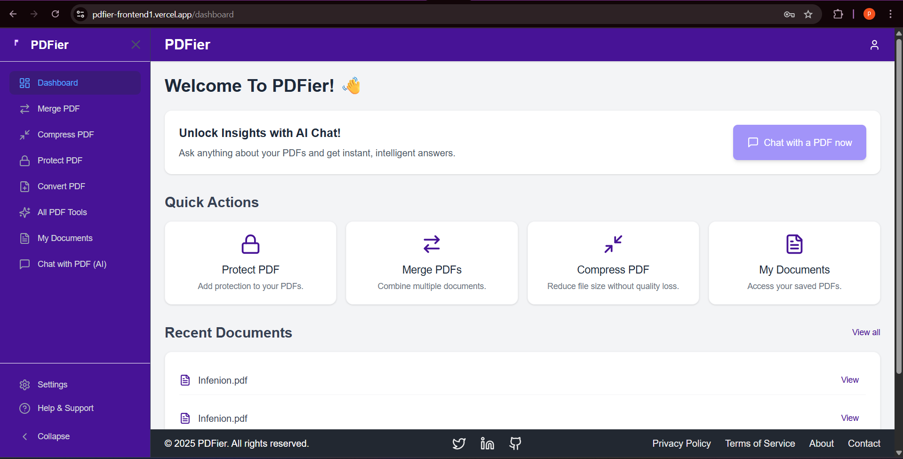
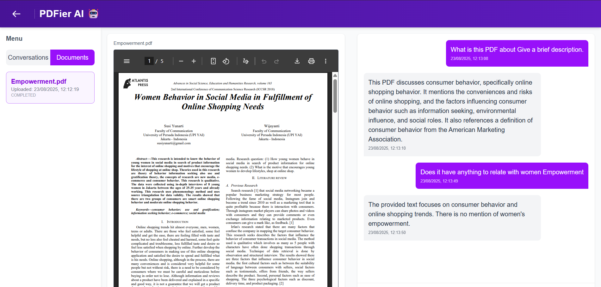
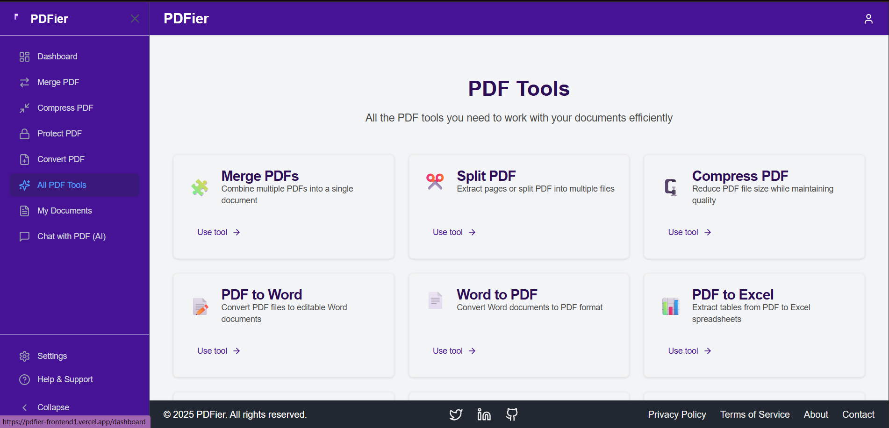
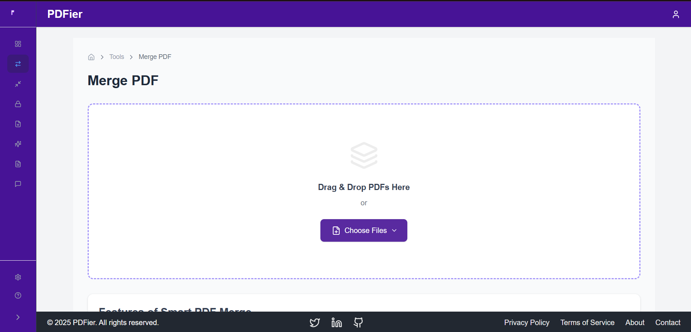

# PDFier - Modern PDF Management with AI Assistant
Overview
PDFier is a Next.js web application designed to simplify PDF management with a powerful suite of tools and an integrated AI chat assistant. It allows users to effortlessly handle documents, from basic editing to advanced, AI-powered queries.

✨ Key Features
🤖 PDF AI Chat Assistant
Intelligent Q&A: Chat with your PDFs to get instant, context-aware answers.

Citation Support: The AI provides direct quotes and page references for accurate information retrieval.

Example Use: "Summarize this document," "What are the key points on page 5?", "Does this document mention [topic]?"

 

📂 Comprehensive PDF Tools
Merge & Split: Combine multiple PDFs into a single document or split a single PDF into multiple files.

 

Compress PDF: Reduce file size while maintaining quality.

Convert PDFs: Transform PDFs to and from various formats like Word and Excel.
 

🖥️ Intuitive User Interface
A clean, modern dashboard for quick access to tools and recent documents.

 

🚀 Tech Stack
Frontend: Next.js 15.3.3, React 19, Radix UI, Tailwind CSS

AI Integration: Gemini API

PDF Processing: react-pdf, pdf-lib

State Management: Zustand

Type Safety: TypeScript

🛠️ Getting Started
Prerequisites
Node.js (v18+)

Gemini API Key

Installation
Bash

<h3>1. Clone the repository</h3>
git clone https://github.com/yourusername/PDFier_frontend.git
cd PDFier_frontend/pdfier

<h3>2. Install dependencies</h3>
npm install

<h3>3. Set up environment variables</h3>
Create a .env.local file with your OpenAI API key
NEXT_PUBLIC_OPENAI_API_KEY=your_openai_api_key

<h3>4. Run the development server</h3>
npm run dev
Open http://localhost:3000 in your browser.

🚀 Deployment
Vercel (Recommended): One-click deployment by importing your GitHub repository.

Other platforms: Supports standard Next.js build (npm run build).

📄 License
This project is licensed under the MIT License. See the LICENSE file for details.

